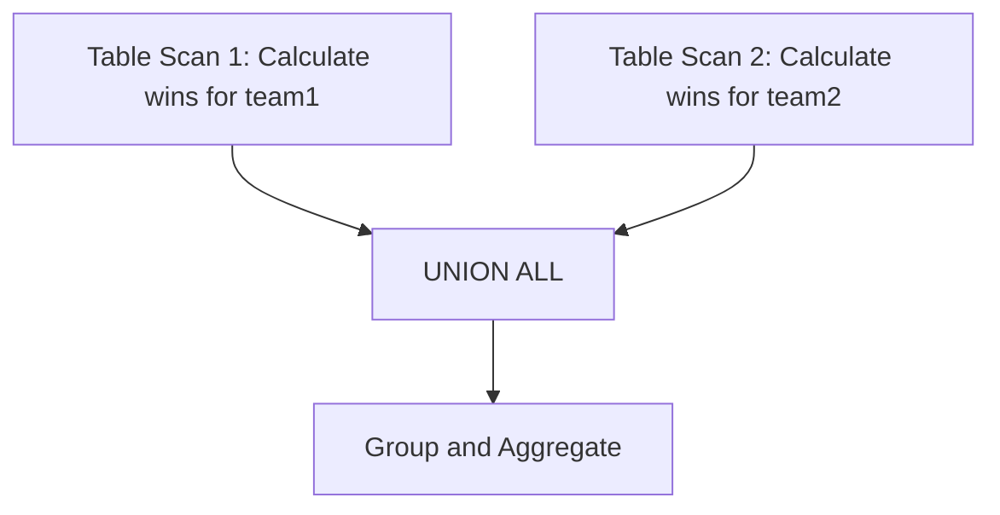
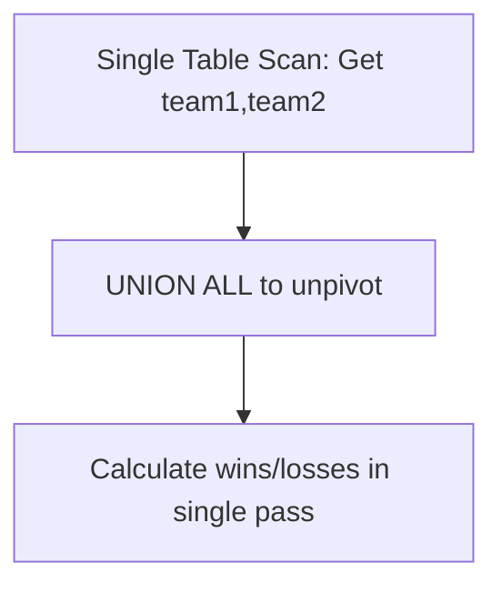

*[Complex SQL Query 1 | Derive Points table for ICC tournament](https://www.youtube.com/watch?v=qyAgWL066Vo)*

# ICC World Cup Analysis - Approach 2

## Input Data
```sql
SELECT * FROM icc_world_cup iwc
```

Sample Data:
| Team1 | Team2 | Winner |
|-------|--------|---------|
| Ind   | SL     | Ind     |
| SL    | Aus    | Aus     |
| SA    | Eng    | Eng     |
| Eng   | NZ     | NZ      |
| Aus   | Ind    | Ind     |

## Step 1: Unpivoting

### Query for Team1
```sql
SELECT team1 AS team, winner FROM icc_world_cup iwc
```

Result:
| Team | Winner |
|------|---------|
| Ind  | Ind     |
| SL   | Aus     |
| SA   | Eng     |
| Eng  | NZ      |
| Aus  | Ind     |

### Query for Team2
```sql
SELECT team2 AS team, winner FROM icc_world_cup iwc
```

Result:
| Team | Winner |
|------|---------|
| SL   | Ind     |
| Aus  | Aus     |
| Eng  | Eng     |
| NZ   | NZ      |
| Ind  | Ind     |

## Step 2: Union All Results

Combined results with win/loss indicators:
| Team | Winner | Win | Loss |
|------|---------|-----|------|
| Ind  | Ind     | 1   | 0    |
| SL   | Aus     | 0   | 1    |
| SA   | Eng     | 0   | 1    |
| Eng  | NZ      | 0   | 1    |
| Aus  | Ind     | 0   | 1    |
| SL   | Ind     | 0   | 1    |
| Aus  | Aus     | 1   | 0    |
| Eng  | Eng     | 1   | 0    |
| NZ   | NZ      | 1   | 0    |
| Ind  | Ind     | 1   | 0    |

## Step 3: Final Aggregation
Final results after grouping:
| Team | Matches | Wins | Losses |
|------|---------|------|--------|
| Ind  | 2       | 2    | 0      |
| NZ   | 1       | 1    | 0      |
| Aus  | 2       | 1    | 1      |

## Optimization Explanation

### Approach Comparison

Both approaches use UNION ALL, but differ in efficiency:

#### Original Approach (More Table Scans):


Here, the database needs to:

1. Scan the table to calculate wins for team1
2. Scan the table again to calculate wins for team2
3. Combine results with UNION ALL
4. Perform grouping and aggregation
5. Optimized Approach:


#### Optimized Solution:


### Final Optimized Query
```sql
SELECT 
    team,
    COUNT(*) AS matches_played,
    SUM(CASE WHEN team = winner THEN 1 ELSE 0 END) AS num_of_wins,
    SUM(CASE WHEN team != winner THEN 1 ELSE 0 END) AS num_of_losses
FROM (
    SELECT team1 AS team, winner FROM icc_world_cup
    UNION ALL 
    SELECT team2 AS team, winner FROM icc_world_cup
) t
GROUP BY team
ORDER BY num_of_wins DESC;
```

The optimization comes from:
- Single table scan for data retrieval
- Using UNION ALL for unpivoting only
- Calculating wins/losses in a single aggregation pass

The key optimization is not eliminating UNION ALL, but rather restructuring when and where we perform the calculations.